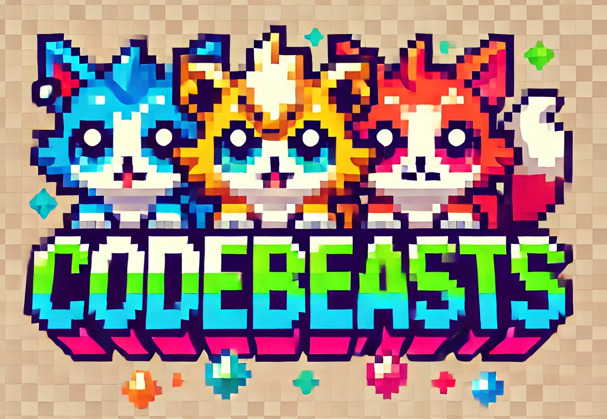
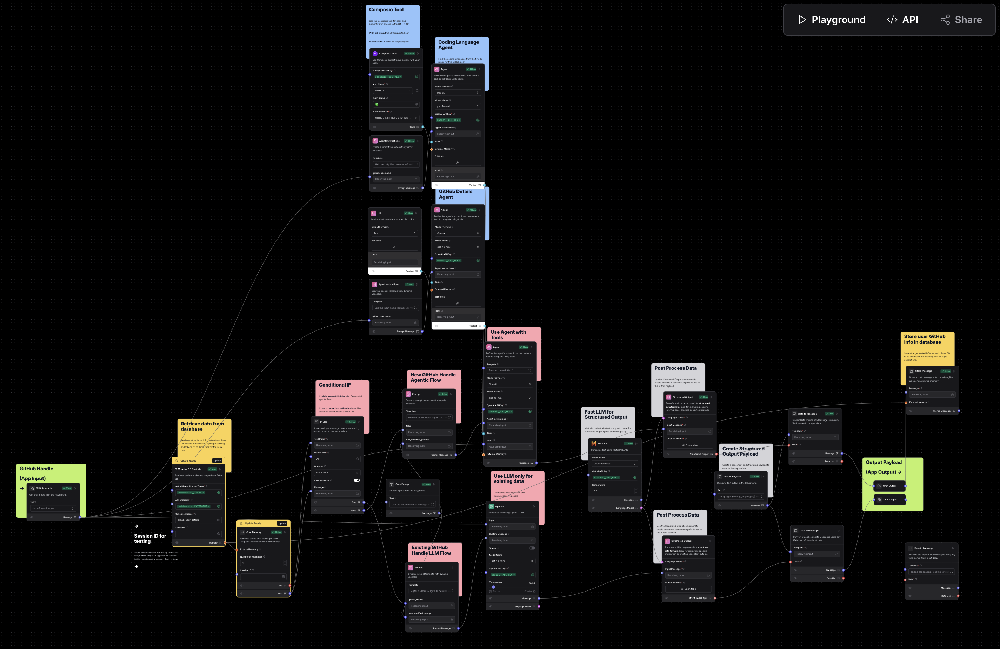

# CodeBeasts AI Generator

<div align="center">
  
</div>

Turn your GitHub profile into a unique AI-generated creature! This project analyzes your GitHub activity and programming languages to create a personalized pixel art mascot using AI image generation.

Agentic AI powered by [Langflow](https://langflow.new)

## Live Demo
Visit [CodeBeasts](https://codebeasts.lovable.app/) to try it out!

## Langflow
We've included the `Cute_Animal_Generator.json` file which contains the Langflow AI workflow used in this project. To use it:

1. Visit [Langflow](https://github.com/langflow-ai/langflow) and follow the instructions to install
2. Click on "Upload a Flow"
3. Upload the `Cute_Animal_Generator.json` file
4. You'll now have access to the complete AI workflow that powers CodeBeasts!

<div align="center">
  
</div>

This workflow demonstrates how to create an agentic AI system with tool use that generates personalized mascots based on GitHub profiles and stores the results in a database.

## Features
- Agentic AI using Langflow
- GitHub profile analysis
- Programming language detection
- AI-powered image generation using Stability AI and Dall-E
- Downloadable and shareable mascot images
- Real-time progress updates
- Pixel art style mascots with unique personalities

## Project Structure
```
/
├── src/              # Frontend React application
├── api/              # Backend Flask application
└── public/           # Static assets
```

## Setup Instructions

### Frontend Setup
```bash
# Install frontend dependencies
npm install

# Start the development server
npm run dev
```

### Backend Setup
```bash
# Navigate to the api directory
cd api

# Create a virtual environment
python -m venv venv

# Activate the virtual environment
# On Windows:
venv\Scripts\activate
# On Unix or MacOS:
source venv/bin/activate

# Install dependencies
pip install -r requirements.txt

# Copy the example env file
cp .env.example .env

# Update the .env file with your API keys and settings
# You'll need:
# - Stability API key for Stability AI
```

The frontend will be available at http://localhost:8080
The backend API will be available at http://localhost:5000

## Environment Variables

Create a `.env` file in the root directory with the following variables:
```
# API Configuration
LANGFLOW_BASE_URL=your_langflow_base_url_here
LANGFLOW_FLOW_ID=your_langflow_flow_id_or_endpoint_namehere

# Image Generation API Configuration
OPENAI_API_KEY=your_openai_api_key_here (for Dall-E)
STABILITY_API_KEY=your_stability_api_key_here (for Stability AI)

# Vite Configuration
VITE_API_URL=http://localhost:5000
```

## Image Generation Model

The application uses both Dall-E and Stability AI's latest model for image generation:

- **Stability AI SD3**
  - Uses Stability AI's latest model for image generation
  - Advanced model optimized for pixel art generation
  - Creates unique, personalized mascots
  - Requires STABILITY_API_KEY
  
- **Dall-E 3**
  - Uses OpenAI's Dall-E model for image generation
  - Requires OPENAI_API_KEY

## Contributing

Feel free to open issues and submit pull requests to help improve CodeBeasts!
