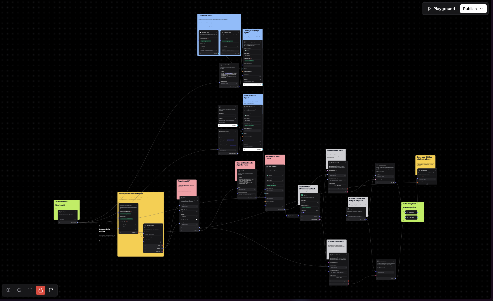

# CodeBeasts AI Generator

<div align="center">
  
</div>

Turn your GitHub profile into a unique AI-generated creature! This project analyzes your GitHub activity and programming languages to create a personalized pixel art mascot using AI image generation.


## Technical Overview

CodeBeasts is a full-stack application built with modern technologies:

### Application Framework
- **[Next.js](https://nextjs.org/)**: React framework using the App Router for server-side rendering, API routes, and static generation.
- **[React](https://reactjs.org/)**: Frontend library for building user interfaces.
- **[TypeScript](https://www.typescriptlang.org/)**: For type-safe development.

### Styling & UI
- **[Tailwind CSS](https://tailwindcss.com/)**: Utility-first CSS framework for responsive styling.
- **[Shadcn UI](https://ui.shadcn.com/)**: Accessible and customizable UI components built on Radix UI and Tailwind CSS.

### Data Fetching & State
- **[Tanstack Query (React Query)](https://tanstack.com/query/latest)**: For efficient client-side data fetching and caching (used in the gallery).
- **Standard `fetch`**: Used within Next.js Server Components and API routes.

### AI & Backend
- **[Langflow](https://langflow.new)**: Orchestration layer for the AI agent, connecting GitHub analysis, prompt generation, and image generation. Hosted via DataStax Cloud.
- **[EverArt](https://everart.ai)**: AI image generation service accessed via Langflow.
- **[Astra DB](https://astra.datastax.com/)**: Cloud-native NoSQL database (based on Apache Cassandra®) used to store generated images and user data.
- **Next.js API Routes**: Backend logic for interacting with Langflow and Astra DB is handled within the Next.js application at `app/api/`.

## Live Demo

Visit <a href="https://codebeasts.ai/" target="_blank">CodeBeasts</a> to try it out!

1. Enter your GitHub handle (if you don't have one, just use your name separated by -'s)
2. Choose a type (Action Figure, Ghibli, etc...)
3. Upload an image of yourself (optional)
4. Generate!
5. You can download, print, or share your unique creation on Twitter

## Langflow Workflow



This project utilizes a workflow built and hosted with [Langflow](https://langflow.new). The core logic involves:

1.  Enter your GitHub handle
2. Upload and image of yourself (optional)
3. A Langflow based AI agent scans your GitHub repositories
4. The agent identifies your most-used programming languages
5. Each language is associated with an animal (based on O'Reilly animal references)
- Python = Snake 🐍
- TypeScript = Blue Jay 🐦
- JavaScript = Rhino 🦏
- A bunch of others...
6. An AI agent generates a prompt for a "CodeBeast" combining all the animals together
7. Finally, it passes GitHub details and the prompt to the app for image generation and displays the result


You can view the specific flow structure used for this project here:
[https://langflow.new/ui/f/codebeasts](https://langflow.new/ui/f/codebeasts)

*(Note: The public link shows the structure; the production version runs on a hosted instance.)*

## Features

- Agentic AI orchestration using Langflow.
- GitHub profile analysis.
- AI-powered image generation using EverArt.
- Persistent storage of generated images using Astra DB.
- Gallery view for browsing generated beasts.
- Downloadable, shareable, and printable mascot images.

## Project Structure

```
codebeasts/
├── app/                # Next.js App Router directory
│   ├── api/            # API route handlers
│   ├── components/     # React components (feature, UI, layout)
│   ├── gallery/        # Gallery page
│   ├── hooks/          # Custom React hooks
│   ├── utils/          # App-specific utilities
│   ├── direct/         # Dynamic user routes
│   └── page.tsx        # Main index page component
│   └── layout.tsx      # Root layout component
├── lib/                # Shared utilities, data fetching, and database logic
│   └── db/             # Database-specific utilities
├── types/              # TypeScript type definitions
├── public/             # Static assets
├── .env.local
├── .env.example
├── next.config.js
├── tailwind.config.ts
├── tsconfig.json
├── package.json
├── render.yaml
└── README.md
```

## Getting Started & Setup Instructions

Follow these steps to set up and run the project locally:

1.  **Clone the repository:**
    ```bash
    git clone https://github.com/yourusername/codebeasts.git # Replace with actual repo URL
    cd codebeasts
    ```

2.  **Install dependencies:**
    ```bash
    npm install
    ```

3.  **Set up environment variables:**
    *   Copy the example environment file:
        ```bash
        cp .env.example .env.local
        ```
    *   Edit the `.env.local` file and add your required API keys and endpoints. See the Environment Variables section below.

4.  **Run the development server:**
    ```bash
    npm run dev
    ```

5.  Open [http://localhost:3000](http://localhost:3000) in your browser to see the result.

## Environment Variables

Create a `.env.local` file in the project root (copy from `.env.example`) and configure the following variables:

```dotenv
# Langflow Configuration (Replace with your actual Langflow instance details)
LANGFLOW_BASE_URL=https://your-langflow-instance.com
LANGFLOW_FLOW_ID=your_langflow_flow_id_or_endpoint

# EverArt API Key (Store securely, especially in production)
EVERART_API_KEY=your_everart_api_key_here

# Astra DB Credentials (Store securely, especially in production)
ASTRA_DB_ENDPOINT=your_astra_db_api_endpoint_here
ASTRA_DB_APPLICATION_TOKEN=your_astra_db_application_token_here

# --- Client-side variables (must match server-side) ---
# These are exposed to the browser via Next.js
NEXT_PUBLIC_LANGFLOW_BASE_URL=${LANGFLOW_BASE_URL}
NEXT_PUBLIC_LANGFLOW_FLOW_ID=${LANGFLOW_FLOW_ID}

# --- Optional for Deployment ---
# Set this to your public deployment URL if needed for absolute URL generation
# NEXT_PUBLIC_APP_URL=https://your-deployed-app-url.com
```

**Important:**
- Obtain API keys and endpoints from [EverArt](https://everart.ai), [Astra DB](https://astra.datastax.com/), and your [Langflow](https://langflow.new) instance.
- **Never commit your `.env.local` file to Git.** Use Render Environment Groups or Secret Files for production secrets.

## Image Generation Model

This application uses [EverArt](https://everart.ai) for AI image generation, orchestrated via a [Langflow](https://langflow.new) workflow. The specific model used within EverArt might vary depending on the Langflow configuration and EverArt's offerings.

## Deployment

This application is configured for deployment on [Render](https://render.com/) using the included `render.yaml` file. Ensure your environment variables (especially secrets like API keys and database tokens) are configured securely within Render's environment settings.

## Contributing

Contributions are welcome! Please feel free to submit Issues and Pull Requests.
